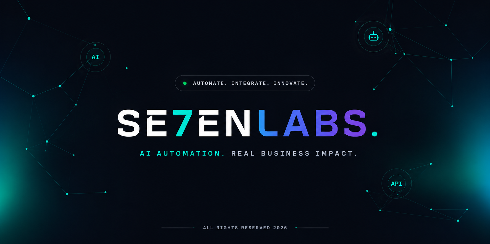

<div align="center">

</div>

# SE7ENLABS — Automation Showroom

A portfolio site for AI workflow engineering — custom automation systems built with n8n, Make.com, Zapier, and LLMs. Includes a real-time AI assistant, project showcase, and booking integration.

## Features

- **Automation Showroom** — filterable project portfolio with full case-study modals
- **AI Assistant** — Gemini-powered chatbot grounded on Von's knowledge base, with form and scheduling actions
- **Contact** — validated contact form (Resend + Make.com webhook)
- **Live Scheduling** — embedded Cal.com unless directly accessible
- **Design** — aurora glassmorphism UI, smooth scrolling (Lenis), light/dark theme

## Stack

React + TypeScript + Vite · Tailwind CSS · Motion · Express · Gemini · Resend

## Getting Started

**Prerequisites:** Node.js (v18+) and npm or bun

```bash
npm install
npm run dev
```

## Environment Variables

Copy `.env.example` to `.env.local` and fill in the values used by the server. `GEMINI_API_KEY` is only needed for live AI chat replies — everything else degrades gracefully without it.

- `GEMINI_API_KEY` — Gemini key for the AI assistant
- `RESEND_API_KEY` / `RESEND_TO_EMAIL` — outgoing email for contact form + AI
- `CAL_API_KEY` / `CAL_EVENT_LINK` — Cal.com scheduling
- `MAKE_WEBHOOK_URL` / `MAKE_API_KEY` — Make.com webhook triggers

## Commands

```bash
npm run dev     # dev server (tsx server.ts)
npm run build   # production build
npm run start   # run the production build
npm run lint    # type-check (tsc --noEmit)
```